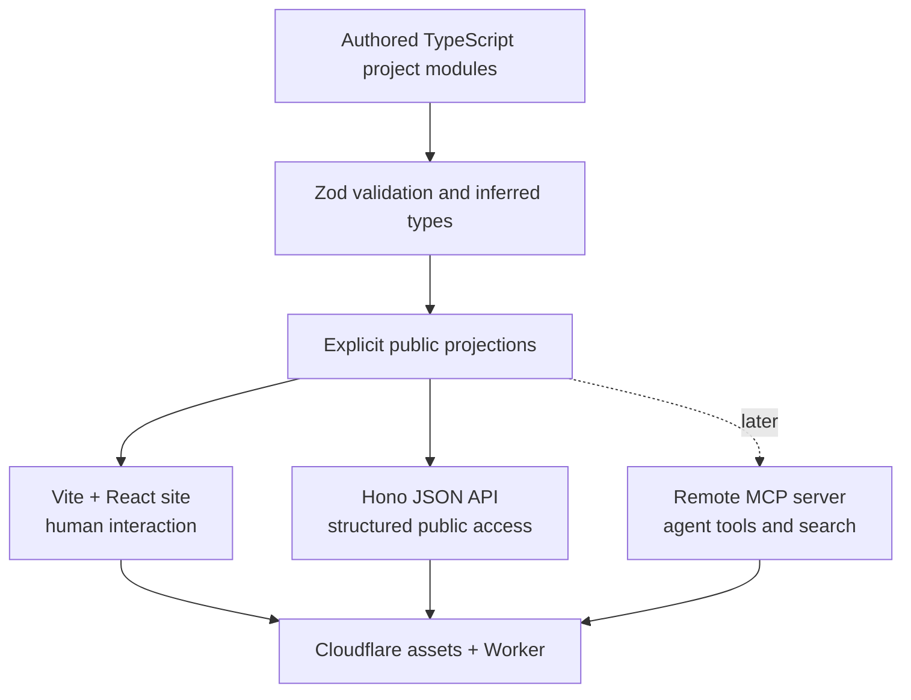

# Central Architecture

## Status

Early design. This document records the current center of gravity without
pretending unresolved implementation details are settled.

## Product idea

The site is a human-first personal site backed by structured public knowledge.
The visual site, JSON API, and MCP server are three projections of the same
curated content.

The homepage is a dark, vertical project catalog. One project is open at a
time. Scrolling changes the active project, collapses completed projects above
it, and brings the next project into view below it. The active project's color
system gradually influences the whole page.

## System shape



The source of truth is authored, version-controlled content in this repository.
GitHub metadata can enrich it later, but GitHub is not queried on page requests
and does not replace editorial control.

## Core product principles

1. **Human first.** The site must be a strong reading and interaction
   experience without knowledge of the API or MCP layer.
2. **Progressive depth.** A visitor can understand a project in one sentence or
   continue into product reasoning, architecture, and proof.
3. **Artifacts over claims.** Prefer working products, actual interfaces,
   decisions, releases, and evidence over generic claims about craft.
4. **One content model.** Site, API, and MCP responses should not drift into
   separate biographies.
5. **Public by construction.** Only explicitly curated public content enters
   the system. Private projects and internal data are excluded.
6. **Restraint.** Interaction and technical complexity must clarify the work,
   not turn the portfolio into a browser, desktop, terminal, or 3D demo.

## Initial pages and interfaces

```text
/                     homepage and selected-work catalog
/work                 complete public project catalog
/work/:slug           project page, designed later
/notes                public decisions and writing
/about                concise profile and background
/api/*                 public structured data
/mcp                   remote MCP transport
```

Only `/` and its one-open-at-a-time catalog are in the first interaction-design
scope. The deeper project experience is recorded as future direction, not a
homepage requirement.

## Project depth model

The current semantic depth vocabulary is:

1. What it is
2. How it feels
3. Why
4. How it is built
5. Shipped

This vocabulary should appear in structured content immediately. The eventual
project pages can decide how much of it is visible or interactive.

## Public projects in the initial catalog

1. ShoutOut - local-first macOS dictation
2. Decyphr - closed-beta founder project for AI video translation
3. Spatium - real-time collaborative apartment layout editor
4. Le Harness - experimental CLI agent harness
5. Cosmic Hot Potato - 2D and 3D semantic word game
6. skills-init - portable project context and skills for coding agents

Cosmic Hot Potato publishes only its hosted product link because its source
repository is private. Decyphr also keeps its original product repository
private and links only to its current public site. The order moves from a
current shipped product to founder experience, collaborative product, systems
depth, technical play, and finally developer utility.
