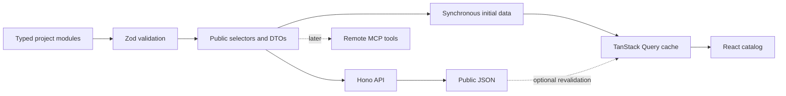
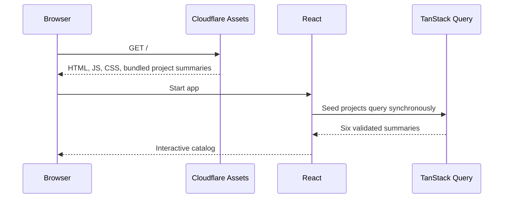
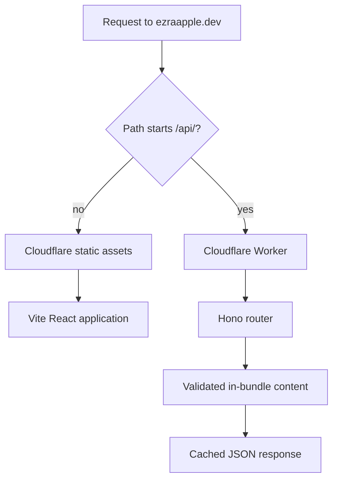
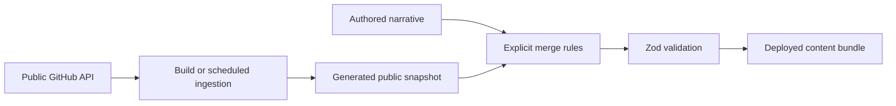

# Data Flow

## Current flow

Authored TypeScript modules are canonical. They are validated and projected
into public shapes before reaching any interface.

## Why there is no loading state

The six project summaries are small and change only when the site deploys.
They are imported into the client bundle and passed to TanStack Query as
`initialData`.

There is no project-data request on the critical rendering path and therefore
no empty skeleton or loading state. TanStack Query still defines the client
data boundary, maintains a stable cache across interactions, and can revalidate
from `/api/projects` if runtime freshness becomes useful later.

## Cloudflare request routing

The Cloudflare Vite plugin runs the same split locally in `workerd`. Wrangler
builds and deploys the client assets and Worker together. No Vercel, database,
CMS, KV, or other hosted service is required.

## Later GitHub enrichment

GitHub can add objective public metadata, but it should remain outside the live
request path.

The authored narrative always wins. A failed GitHub request must never prevent
the page or API from serving the last curated deployment.
