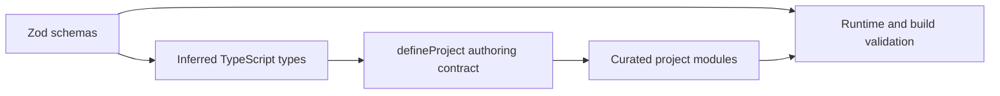
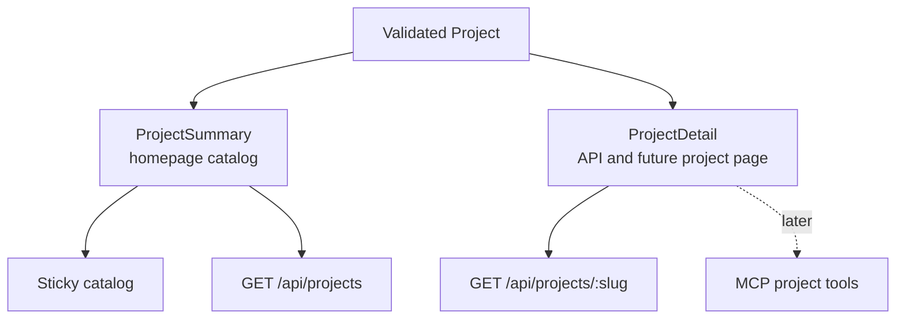

# Project Content Model

## Status

Implemented initial contract. The schema can grow, but site, API, and future MCP
work should continue to derive their types from this boundary.

## Source of truth

`content/projects/schema.ts` contains Zod schemas. TypeScript types are inferred
from those schemas instead of being maintained as parallel interfaces.



Every authored project passes through `defineProject()`. The collection then
validates uniqueness for project slugs and ordering before any consumer can use
it.

## Project shape

```text
Project
  schemaVersion
  slug, order, published
  name, category, status, summary
  tags[]
  links[]
  theme
  artifact
  depth
    what
    experience
    decisions[]
    system
    proof[]
```

The five objects under `depth` are the semantic levels for future project
pages and agent responses. The homepage intentionally receives a smaller
`ProjectSummary` projection containing only the fields it renders.

## Public projections



Projection functions are explicit allowlists. Adding an internal authoring
field does not automatically publish it through the list API or homepage.

## Adding a project

1. Add `content/projects/<slug>.ts` using `defineProject()`.
2. Include it in the authored collection in `content/projects/index.ts`.
3. Use only deliberately public links, facts, and evidence.
4. Run `npm run typecheck`; Zod also validates the data during the build.
5. Tune its OKLCH theme against its adjacent projects.

No database or CMS is involved. Content changes are reviewed in git and become
live with the next deployment.
